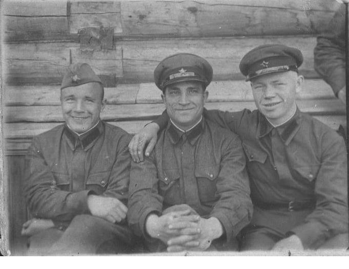
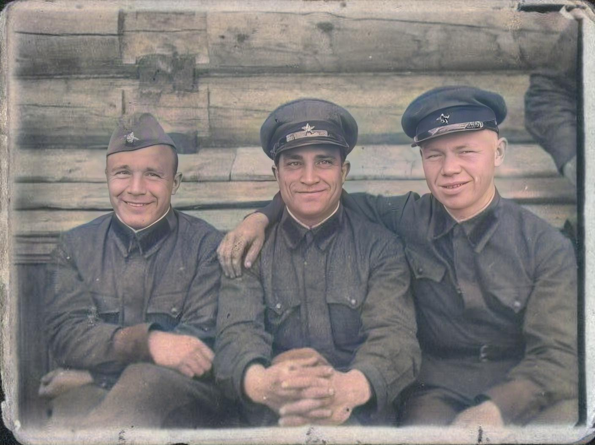
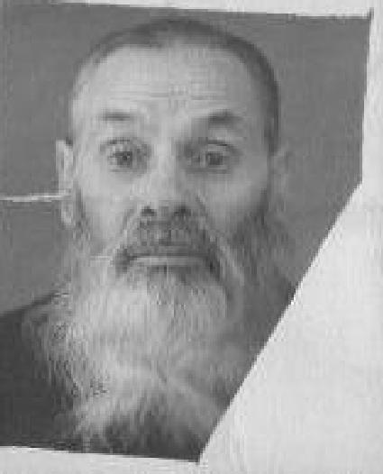
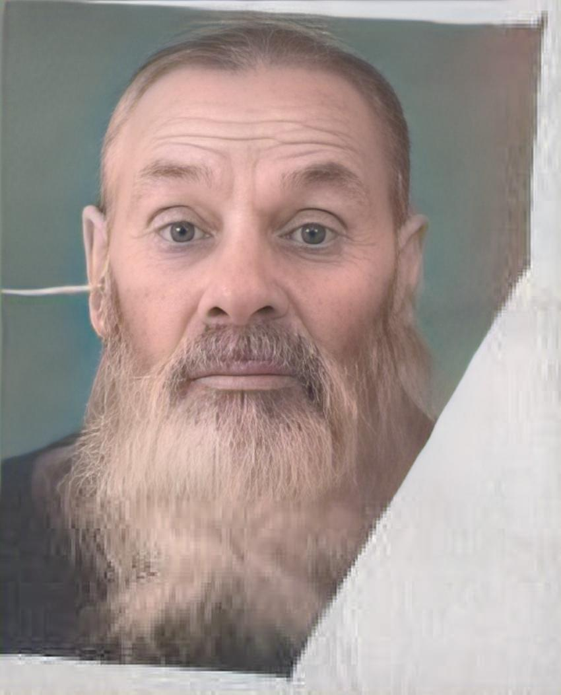

# beautify-old-photo

> Research notebook for restoring facial detail and colorizing old photos with GFPGAN and DeOldify.


[Русская версия](README.ru.md)

| Field | Value |
|---|---|
| Status | Research snapshot |
| Type | ML experiment / notebook demo |
| Primary stack | Python 3, Jupyter / Google Colab, PyTorch, fastai, DeOldify, GFPGAN |
| Inputs | User-provided photos under `/content/input` or local `assets/input/` examples |
| Expected outputs | Restored faces, colorized images, and `colorized_output.zip` from the notebook workflow |
| Reproducibility note | Dependencies are not version-pinned and the Colab bundle is external |

## Goal

This repository preserves a notebook experiment for improving aged or low-quality photos with minimal manual editing:

- restore faces before colorization;
- colorize original and restored images;
- compare local before/after examples.

It is a research demo, not a production image-processing service.

## Method

The notebook combines two upstream projects:

- [GFPGAN](https://github.com/TencentARC/GFPGAN) for real-world face restoration. In this repo it is loaded from the external Colab bundle, not from `requirements.txt` or vendored source files.
- [DeOldify](https://github.com/jantic/DeOldify) for image colorization. The upstream repository is archived, so this project should be treated as a preserved snapshot rather than an actively maintained pipeline.

The local `requirements.txt` only lists unpinned top-level Python dependencies:

```txt
torch
fastai
deoldify
```

## Reproducibility

The most realistic path is to open the notebook in Google Colab and follow its cells:

```sh
# optional local dependency bootstrap for notebook exploration
pip install -r requirements.txt

# open the notebook manually
jupyter notebook BeautifyOldPhoto.ipynb
```

Important reproducibility notes:

- `BeautifyOldPhoto.ipynb` downloads an external `libs_beautify_photo.zip` bundle and installs `/content/colab_requirements.txt` inside Colab.
- The repo does not vendor the GFPGAN source tree, pretrained models, `libs_beautify_photo.zip`, or `colab_requirements.txt`.
- Python is documented only as a generic Python 3 / Colab runtime; exact package versions are not pinned.
- Running the full notebook can require network access, model downloads, and a GPU-capable runtime.

| Input / output | Path | Notes |
|---|---|---|
| Example inputs | `assets/input/photo1.JPG`, `assets/input/photo2.JPG` | Static sample photos committed to the repo |
| Notebook input folder | `/content/input` | Upload your own photos here in Colab |
| GFPGAN output | `/content/high_resolution_output` | Face restoration output generated by the notebook |
| DeOldify output | `/content/final_colorized_output` | Final colorized images generated by the notebook |
| Download bundle | `colorized_output.zip` | Zip archive created by the notebook |

## Results

| Before | After |
|---|---|
|  |  |
|  |  |

## Assumptions and limitations

- Works best on photos with recoverable facial detail.
- Output quality depends on source resolution, damage level, model weights, and runtime environment.
- Colorization is probabilistic and can introduce historically inaccurate colors or visual artifacts.
- The notebook workflow depends on external archives and upstream model files, so it is not fully self-contained.
- Do not upload sensitive personal photos to third-party notebook runtimes unless that is acceptable for your privacy requirements.
- Generated outputs may retain image metadata depending on the processing path; review files before sharing them publicly.


## References

- GFPGAN: <https://github.com/TencentARC/GFPGAN>
- DeOldify: <https://github.com/jantic/DeOldify>
- Notebook: [`BeautifyOldPhoto.ipynb`](BeautifyOldPhoto.ipynb)

## Status

Research/educational project. Results, dependencies, and runtime assumptions are documented for reproducibility, but the repository is not maintained as a packaged product.

## License

[MIT](LICENSE)
